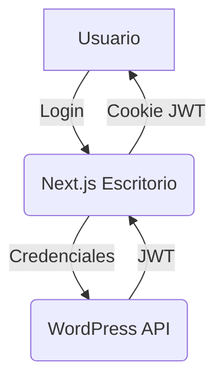
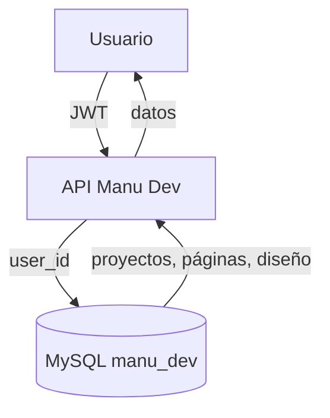
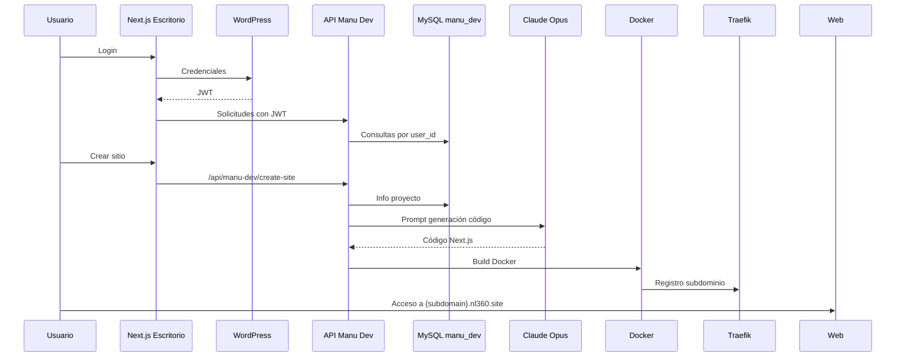

# Explicación visual: Cómo funciona Manu Dev

## 1. Autenticación de usuarios

- El usuario inicia sesión en la plataforma Next.js (Escritorio) usando su usuario y contraseña de WordPress.
- El endpoint `/api/auth/login` envía las credenciales a WordPress (`/wp-json/jwt-auth/v1/token`).
- Si son válidas, WordPress responde con un JWT (token).
- El Escritorio guarda este JWT en una cookie httpOnly (`nl360_jwt`).
- Todas las rutas protegidas de Manu Dev requieren este JWT para identificar al usuario.

**Diagrama:**



---

## 2. Relación con la base de datos

- Manu Dev usa una base de datos MySQL separada (`manu_dev`).
- Cada usuario autenticado tiene un `user_id` (el mismo que en WordPress).
- Las tablas principales:
    - `md_projects`: proyectos/sitios creados por cada usuario (campo `user_id`)
    - `md_pages`: páginas de cada proyecto
    - `md_design`: diseño/brandbook de cada proyecto
- Todas las consultas filtran por `user_id` para que cada usuario solo vea sus propios proyectos.

**Diagrama:**



---

## 3. Proceso de construcción de sitios

1. El usuario crea un proyecto (define nombre, industria, colores, páginas, etc).
2. Cuando el usuario pide "crear sitio":
    - Manu Dev consulta la info del proyecto, diseño y páginas en la DB.
    - Llama a la API de Unsplash para buscar imágenes relevantes.
    - Genera prompts para Claude Opus (Anthropic) para que cree el código Next.js (layout, CSS, páginas, etc).
    - Recibe los archivos generados y los guarda en `/sites/{subdomain}/`.
    - Ejecuta un script que construye una imagen Docker y la lanza con Traefik para exponer el sitio en `{subdomain}.nl360.site`.
    - Actualiza el estado del proyecto en la DB (`building`, `active`, `error`).

**Diagrama:**

```mermaid
graph TD
    U[Usuario] -- Crear sitio --> API[API Manu Dev]
    API -- info proyecto --> DB[(MySQL manu_dev)]
    API -- imágenes --> Unsplash
    API -- prompts --> Claude Opus
    Claude -- código Next.js --> API
    API -- archivos --> FS[/sites/subdomain/]
    API -- build/run --> Docker
    Docker -- Traefik --> Web[{subdomain}.nl360.site]
    API -- estado --> DB
```

---

## 4. Resumen visual del flujo



---

## 5. Tasa de error de Next.js vs Astro

### Next.js
- **Tasa de error**: Moderada. Los errores más comunes al generar sitios automáticamente con IA son:
    - Código JSX truncado o incompleto (por límite de tokens o errores de modelo)
    - Uso incorrecto de componentes (ej: `next/image` en vez de ``, errores de imports)
    - Problemas de dependencias en el build
    - Errores de sintaxis en archivos generados
- **Mitigación**: Manu Dev implementa validaciones, sanitización de JSX y reintentos automáticos (hasta 3 veces) para reducir errores.

### Astro
- **Tasa de error esperada**: Potencialmente menor, porque:
    - Astro es más tolerante a archivos incompletos (renderiza HTML aunque falten partes)
    - El código generado puede ser más simple (menos dependencias, menos lógica JS)
    - Menos restricciones de sintaxis estricta que Next.js
- **Complejidad de migración**:
    - Moderada/Alta. Habría que:
        - Cambiar los prompts para Claude para que genere archivos `.astro` y estructura de proyecto Astro
        - Adaptar el script de build y despliegue (Dockerfile, comandos)
        - Ajustar la lógica de rutas y páginas
        - Validar que la integración con Traefik y el sistema multi-tenant siga funcionando
    - El flujo general (autenticación, relación con DB, generación de archivos, build Docker) sería similar.

---

## 6. Conclusión
- Manu Dev está bien diseñado para Next.js, pero la generación automática con IA siempre tiene una tasa de error no nula.
- Migrar a Astro podría reducir errores de build y despliegue, pero requiere trabajo de adaptación en prompts y scripts.
- La arquitectura multi-tenant y la autenticación seguirían funcionando igual.
